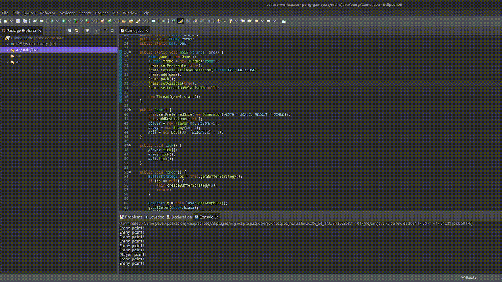

# Pong Game

Simple recreation of the famous Pong Game.

For this project I:

- Created a Game Engine by scratch using tick/run/render concepts
- Created a basic game loop using while true
- Create a game window using JFrame
- Create a Player with basic movements
- Create an Enemy that plays the game in a fair way 